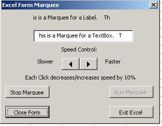



## Excel Marquee \(moving words\)

### Description

This is two .xls files demonstraiting how to make a Marquee in Excel. One shows how to do it in an Excel Cell and the other shows how to do it on an Excel VBA Form. The speed can vary depending on machine, so in code, look for initiating speed variable gsngSpeed = and set this single type number to whatever value is appropriate for the speed of your target computer. Currently it is set to .1
 
### More Info
 

             |
---                |---
**Submitted On**   |2006-09-27 09:29:42
**By**             |[Edward T\. Quinn](https://github.com/Planet-Source-Code/PSCIndex/blob/master/ByAuthor/edward-t-quinn.md)
**Level**          |Beginner
**User Rating**    |4.5 (18 globes from 4 users)
**Compatibility**  |VBA MS Excel
**Category**       |[Microsoft Office Apps/VBA](https://github.com/Planet-Source-Code/PSCIndex/blob/master/ByCategory/microsoft-office-apps-vba__1-42.md)
**World**          |[Visual Basic](https://github.com/Planet-Source-Code/PSCIndex/blob/master/ByWorld/visual-basic.md)
**Archive File**   |[Excel\_Marq2022029272006\.zip](https://github.com/Planet-Source-Code/edward-t-quinn-excel-marquee-moving-words__1-66656/archive/master.zip)

